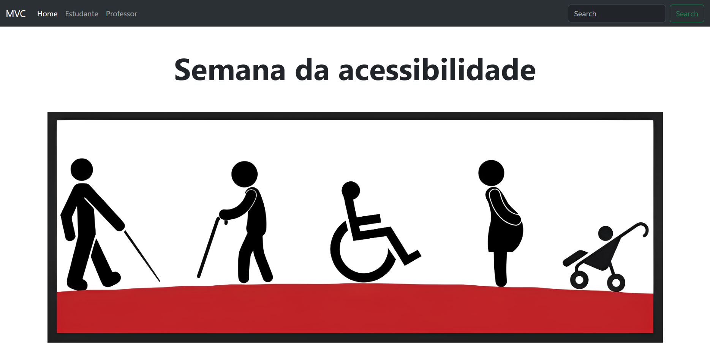
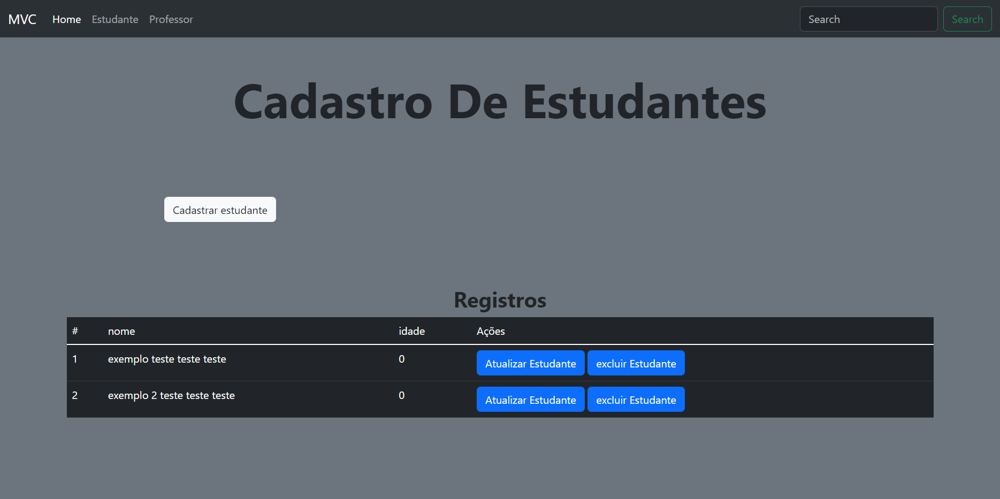
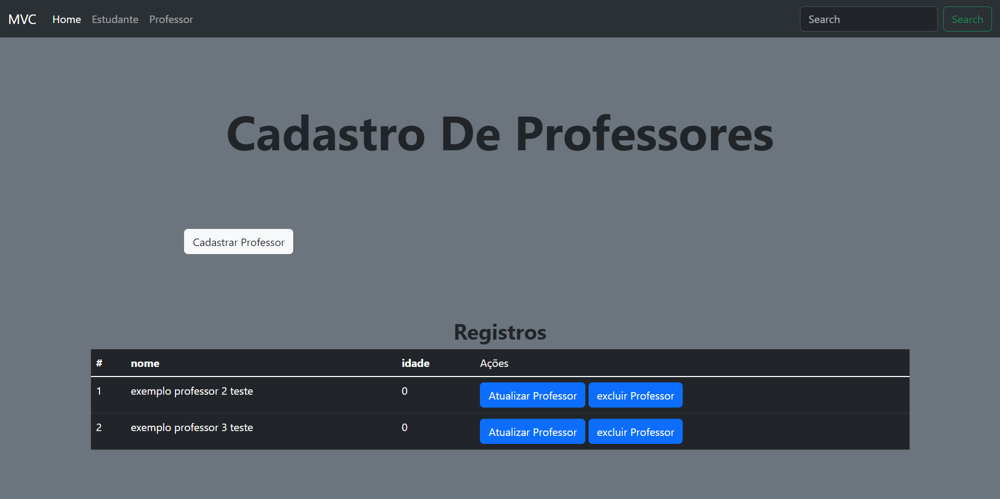
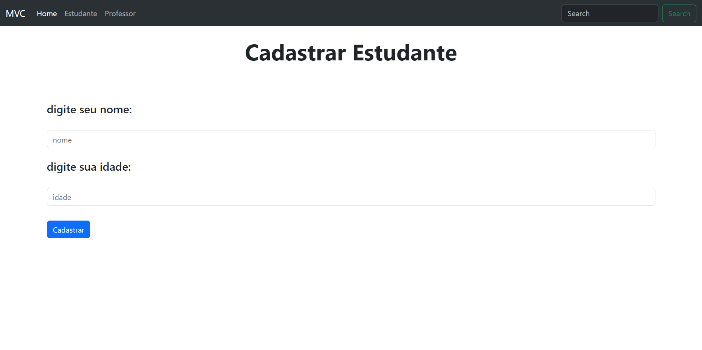
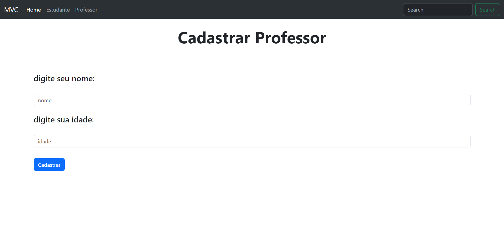
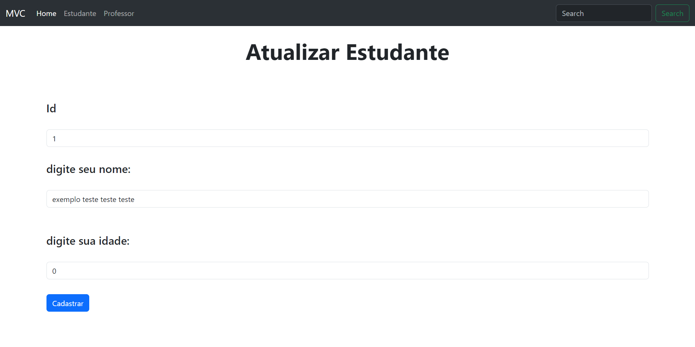
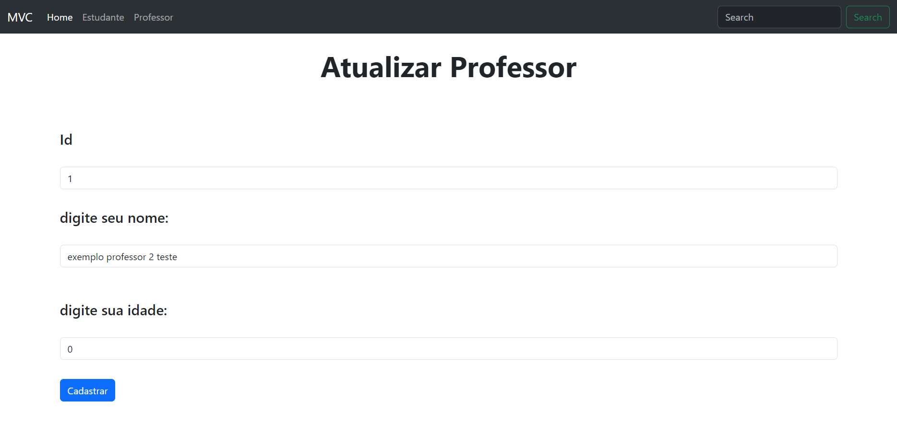

# CRUD em MVC com PHP

Este é um CRUD (Create, Read, Update, Delete) desenvolvido em PHP seguindo a arquitetura MVC (Model-View-Controller).

## Funcionalidades

- **Create**: Permite criar novos registros de professores e estudantes.
- **Read**: Permite a leitura e visualização de registros existentes de professores e estudantes.
- **Update**: Possibilita a atualização de informações de professores e estudantes já cadastrados.
- **Delete**: Permite a exclusão de registros existentes de professores e estudantes.

## Tecnologias Utilizadas

Este projeto utiliza as seguintes tecnologias:

- **PHP**: Linguagem de programação server-side para desenvolvimento do aplicativo.
- **MySQL**: Sistema de gerenciamento de banco de dados para armazenar informações dos professores e estudantes.
- **HTML**: Utilizado para criar a estrutura da interface do usuário.
- **Bootstrap**: Responsável pelo estilo e aparência da aplicação.
#

  <h1>👇 HOME 👇</h1>
  

  <h1>👇 Página de Estudantes 👇</h1>
  

  <h1>👇 Página de Professores 👇</h1>
  

  <h1>👇 Cadastrar Estudante 👇</h1>
  

  <h1>👇 Cadastrar Professor 👇</h1>
  

  <h1>👇 Atualizar Estudante 👇</h1>
  

  <h1>👇 Atualizar Professor 👇</h1>
  

